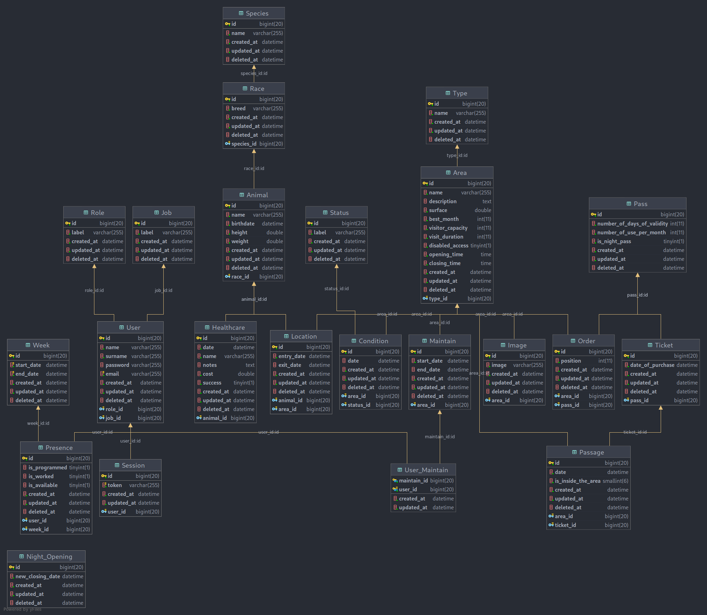

# Planode_Zoo
Réalisation d'une API en Typescript avec l'utilisation de l'ORM Sequelize afin de permettre de gérer un Zoo

## Démarrer l'environnement de dev

### Installer l'ensemble des dépendances du projet
- se placer à la racine du projet
```
npm install
```

### Créer un fichier dev.env avec les mêmes pair clé valeur que dev.env.example
- se placer dans le dossier config
- créer un fichier dev.env en copiant dev.env.example
- remplir toutes les valeurs entre {} par les valeurs correspondant à cotre env de dev

### Start l'env de dev
```
npm run dev
```

## Structure de données
Afin de mieux visualiser la structure de données mise en place nous avons créé un MLD où les tables représentent les différentes entités avec leurs attributs

